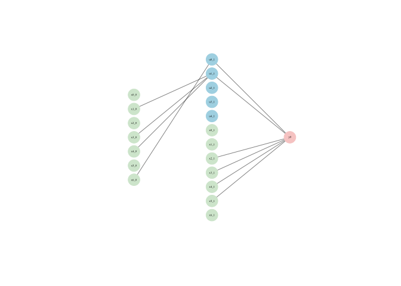
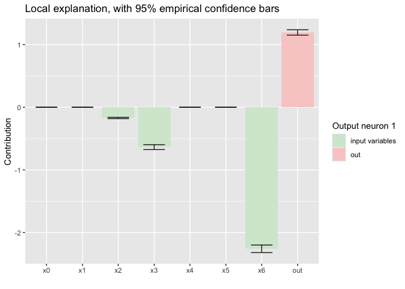

<!-- README.md is generated from README.Rmd. Please edit that file -->

# LBBNN

<!-- badges: start -->

[](https://lifecycle.r-lib.org/articles/stages.html#experimental)
[](https://github.com/LarsELund/LBBNN/commits/main)
[](https://github.com/LarsELund/LBBNN)
[](https://github.com/LarsELund/LBBNN/actions)
[](LICENSE)

<!-- badges: end -->

The package implements LBBNN (Latent Binary Bayesian Neural Networks)
(<https://openreview.net/pdf?id=d6kqUKzG3V>) in R using the LibTorch
backend via the Torch package. Currently, standard LBBNNs are
implemented, using the local reparametrization tricks and optionally
normalizing flows. In addition, the input-skip architecture is also
implemented. <https://arxiv.org/abs/2503.10496>).

## Installation

You can install the development version of LBBNN from
[GitHub](https://github.com/LarsELund/LBBNN) with:

``` r
# install.packages("pak")
pak::pak("LarsELund/LBBNN")
```

## Example

This example demonstrates how to implement a simple feed forward LBBNN
on a small dataset containing morphological features of two types of
raisins.

The get_dataloaders() function takes a data.frame object, and transforms
it to a tensor_dataset, which can be used in a torch_dataloader object.
This enables automatic mini-batching and parallel data loading.

The arguments define the proportion of data to be used for training vs
validation in addition to the batch sizes for the respective
dataloaders.

``` r
library(LBBNN)
loaders <- get_dataloaders(raisin_dataset, train_proportion = 0.8, 
                           train_batch_size = 720, test_batch_size = 180)
train_loader <- loaders$train_loader
test_loader <- loaders$test_loader
```

Important hyperparameters include the size of the network, priors, and
initializations. When defining an ‘lbbnn_net’ object, the sizes argument
is a vector of integers, where the first entry represents the number of
features (7 in this case), the subsequent entries are the widths of the
hidden layers, and the last entry the number of outputs.

The prior argument defines the inclusion priors for each layer, whereas
std refers to the standard deviation of the weight priors.
inclusion_inits refers to the initialization of the variationa
linclusion parameters. It controls the initial density of the network.

``` r
problem <- 'binary classification'
sizes <- c(7, 5, 5, 1) 
inclusion_priors <-c(0.5, 0.5, 0.5) 
stds <- c(1, 1, 1) 
inclusion_inits <- matrix(rep(c(-10, 15), 3),nrow = 2, ncol = 3)
device <- 'cpu' #can also be mps or gpu.
```

Below we define the model. We use the input_skip architecture in this
case, but not normalizing flows.

``` r
torch::torch_manual_seed(0)
model_input_skip <- lbbnn_net(problem_type = problem,sizes = sizes,prior = inclusion_priors,
                      inclusion_inits = inclusion_inits,input_skip = TRUE,std = stds,
                   flow = FALSE,device = device)
```

The function lbbnn_train is used to train the model. In this case for
800 epochs with a learning rate of 0.01. During training, the loss and
accuracy can be displayed at each epoch.

``` r
results_input_skip <- suppressMessages(train_lbbnn(epochs = 800,LBBNN = model_input_skip, lr = 0.01,train_dl = train_loader,device = device))
#save the model 
#torch::torch_save(model_input_skip$state_dict(), 
#paste(getwd(),'/R/saved_models/README_input_skip_example_model.pth',sep = ''))
```

Below, validate_lbbnn is used to test the model on unseen data. We
provide the test_loader, containing the data set aside.

``` r
validate_lbbnn(LBBNN = model_input_skip,num_samples = 100,test_dl = test_loader,device)
#> $accuracy_full_model
#> [1] 0.8666667
#> 
#> $accuracy_sparse
#> [1] 0.8555555
#> 
#> $density
#> [1] 0.1214953
#> 
#> $density_active_path
#> [1] 0.09345794
#validate_lbbnn(LBBNN = model_flows,num_samples = 1000,test_dl = test_loader,device)
```

The package provides utilities for both global and local explanations.
Global explanations describe how the models behaves overall across the
entire dataset. The function plot, with argument type = ‘global’
visualizes the structure of the network, when only weights within active
paths are included, where an active path is a path from an input, to the
output, either directly or through one or more hidden neurons.

``` r
plot(model_input_skip,type = 'global',vertex_size = 13,edge_width = 0.6,label_size = 0.6)
```



We see that only 4 of the 7 input variables are included..

The summary function provides further detail into inclusion
probabilities from different layers.

``` r
summary(model_input_skip)
#> Summary of lbbnn_net object:
#> -----------------------------------
#> Shows the number of times each variable was included from each layer
#> -----------------------------------
#> Then the average inclusion probability for each input from each layer
#> -----------------------------------
#> The final column shows the average inclusion probability across all layers
#> -----------------------------------
#>    L0 L1 L2    a0    a1    a2 a_avg
#> x0  0  0  0 0.136 0.077 0.035 0.100
#> x1  0  0  0 0.325 0.064 0.149 0.190
#> x2  0  1  0 0.076 0.336 0.080 0.194
#> x3  1  0  1 0.425 0.267 0.999 0.406
#> x4  1  1  0 0.327 0.352 0.058 0.314
#> x5  0  1  0 0.140 0.280 0.230 0.212
#> x6  0  0  1 0.058 0.256 0.988 0.232
#> The model took 10.819 seconds to train, using cpu
```

Local explanations aim to explain a model’s prediction for a specific
observation by quantifying how each input feature influences that
prediction. Below we show one example. Unlike other methods like SHAP
and LIME, our local explanations are intrinsic, and we also get
uncertainty around the explanations.

``` r
x <- train_loader$dataset$tensors[[1]] #grab the dataset
ind <- 42
data <- x[ind,] #plot this specific data-point
plot(model_input_skip,type = 'local',data = data,num_samples = 100)
```



The residual function computes the residuals: y_true - y_predicted

``` r
residuals(model_input_skip)[1:10]
#>  [1] -0.23637275  0.05227208 -0.04005997  0.13478029  0.20345378 -0.09961643
#>  [7]  0.05248320  0.14917880 -0.07054520  0.06071264
```

coef gives the local explanations average over multiple samples:

``` r
coef(model_input_skip,dataset = train_loader,inds = c(2,3,4,5,6))
#>         lower       mean      upper
#> x0  0.0000000  0.0000000  0.0000000
#> x1  0.0000000  0.0000000  0.0000000
#> x2 -1.4081770 -1.0450520 -0.1182637
#> x3 -3.0491267 -1.5438678 -0.5097757
#> x4 -1.5836792 -0.5174002  0.8989937
#> x5  0.0000000  0.3023412  0.5179587
#> x6 -0.7162537 -0.6587479 -0.6052896
```

posterior predictions:

``` r
predictions <- predict(model_input_skip,mpm = TRUE,newdata = test_loader,draws = 100)
dim(predictions) #shape is (draws,samples,classes)
#> [1] 100 180   1
```

Print the model:

``` r
print(model_input_skip)
#> 
#> ========================================
#>           LBBNN Model Summary           
#> ========================================
#> 
#> Module Overview:
#>   - An `nn_module` containing 343 parameters.
#> 
#> ---------------- Submodules ----------------
#>   - layers               : nn_module_list  # 305 parameters
#>   - layers.0             : lbbnn_linear    # 115 parameters
#>   - layers.1             : lbbnn_linear    # 190 parameters
#>   - act                  : nn_leaky_relu   # 0 parameters
#>   - out_layer            : lbbnn_linear    # 38 parameters
#>   - out                  : nn_sigmoid      # 0 parameters
#>   - loss_fn              : nn_bce_loss     # 0 parameters
#> 
#> Model Configuration:
#>   - LBBNN with input-skip 
#>   - Optimized using variational inference without normalizing flows 
#> 
#> Priors:
#>   - Prior inclusion probabilities per layer:  0.5, 0.5, 0.5 
#>   - Prior std dev for weights per layer:     1, 1, 1 
#> 
#> =================================================================
```
