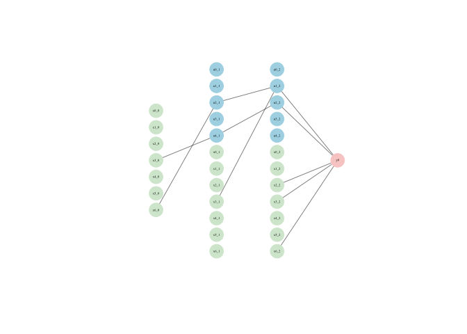
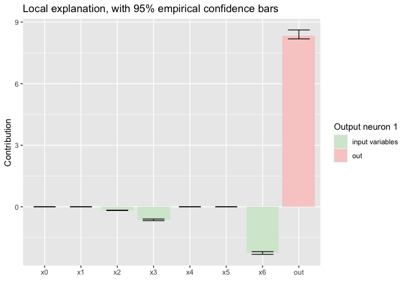

<!-- README.md is generated from README.Rmd. Please edit that file -->

# LBBNN

<!-- badges: start -->

[](https://lifecycle.r-lib.org/articles/stages.html#experimental)
[](https://github.com/LarsELund/LBBNN/commits/main)
[](https://github.com/LarsELund/LBBNN)
[](https://github.com/LarsELund/LBBNN/actions)
[](LICENSE)

<!-- badges: end -->

The goal of LBBNN is to implement Latent Bayesian Binary Neural Networks
(<https://openreview.net/pdf?id=d6kqUKzG3V>) in R, using the torch for R
package. Currently, standard LBBNNs are implemented. In the future, we
will also implement LBBNNs with input-skip (see
<https://arxiv.org/abs/2503.10496>).

## Installation

You can install the development version of LBBNN from
[GitHub](https://github.com/LarsELund/LBBNN) with:

``` r
# install.packages("pak")
pak::pak("LarsELund/LBBNN")
```

## Example

This is a basic example which shows you how to implement a simple feed
forward LBBNN on the raisin dataset, both using the mean-field
posterior, and normalizing flows. First we demonstrate how to preprocess
the data so it can be used in the torch ecosystem

``` r
library(LBBNN)
library(ggplot2)
library(torch)

#the get_dataloaders function takes a data.frame dataset as input, then splits the data
#in a training and validation set based on train_proportion, and returns torch dataloader 
#objects.
loaders <- get_dataloaders(Raisin_Dataset,train_proportion = 0.8,train_batch_size = 720,test_batch_size = 180)
train_loader <- loaders$train_loader
test_loader <- loaders$test_loader
```

To initialize the LBBNN, we need to define some hyperparameters. First,
the user has to define what type of problem it is. This could be either
binary classification (as in this case), multiclass classification (more
than two classes), or regression (continuous output). In addition the
user defines a size vector, where the first element is the number of
variables in the dataset (7 in this case), the last element is the
number of output neurons (1 in our case), and the elements in between
define the number of neurons in the hidden layer(s). The user must
define the prior inclusion probability for each weight matrix (where
each weight will have the same prior probability). This is an important
parameter, as it controls what prior knowledge the user may have about
how dense they believe the network should be. In addition to this, the
user defines the prior standard deviation for the weight and bias
parameters. The user also defines the initialization of the inclusion
parameters.

``` r
problem <- 'binary classification'
sizes <- c(7,5,5,1) #7 input variables, one hidden layer of 100 neurons, 1 output neuron.
inclusion_priors <-c(0.5,0.5,0.5) #one prior probability per weight matrix.
stds <- c(1,1,1) #prior standard deviation for each layer.
inclusion_inits <- matrix(rep(c(-10,15),3),nrow = 2,ncol = 3) #one low and high for each layer
device <- 'cpu' #can also be mps or gpu.
```

We are now ready to define the models, here we show one with the
mean-field posterior, and one with normalizing flows:

``` r
torch_manual_seed(0)
model_input_skip <- LBBNN_Net(problem_type = problem,sizes = sizes,prior = inclusion_priors,
                      inclusion_inits = inclusion_inits,input_skip = TRUE,std = stds,
                   flow = FALSE,device = device)
model_LBBNN <- LBBNN_Net(problem_type = problem,sizes = sizes,prior = inclusion_priors,
                   inclusion_inits = inclusion_inits,input_skip = FALSE,std = stds,
                   flow = FALSE,device = device)
```

To train the models, we have a function called train_LBBNN, which takes
as arguments the number of epochs to train for, the model to train, the
learning rate, and the data to train on:

``` r
#model_input_skip$local_explanation = TRUE #to make sure we are using RELU
results_input_skip <- train_LBBNN(epochs = 800,LBBNN = model_input_skip, lr = 0.005,train_dl = train_loader,device = device)
#save the model 
torch::torch_save(model_input_skip$state_dict(), 
paste(getwd(),'/R/saved_models/README_input_skip_example_model.pth',sep = ''))
```

To check the results on the validation data, we use the function
Validate_LBBNN, which takes as input a model, the number of samples for
model averaging, and the validation data.

``` r
validate_LBBNN(LBBNN = model_input_skip,num_samples = 100,test_dl = test_loader,device)
#> $accuracy_full_model
#> [1] 0.8722222
#> 
#> $accuracy_sparse
#> [1] 0.8666667
#> 
#> $density
#> [1] 0.2523364
#> 
#> $density_active_path
#> [1] 0.09345794
#validate_LBBNN(LBBNN = model_flows,num_samples = 1000,test_dl = test_loader,device)
```

Plot the network structure of the given model:

``` r
LBBNN_plot(model_input_skip,layer_spacing = 1,neuron_spacing = 1,vertex_size = 15,edge_width = 0.5)
```



Note that only 3 of the 7 input variables are used, with one of them
just a linear connection.

This can also be seen using the custom summary function:

``` r
summary(model_input_skip)
#> Summary of LBBNN_Net object:
#> -----------------------------------
#> Shows the number of times each variable was included from each layer
#> In addition to the average local explanation (contribution) for one random input
#> -----------------------------------
#>    L0 L1 L2 mean_explanation
#> x0  0  0  0             0.00
#> x1  0  0  0             0.00
#> x2  0  0  1            -0.17
#> x3  1  1  1            -0.63
#> x4  0  0  0             0.00
#> x5  0  0  0             0.00
#> x6  1  0  1            -2.25
```

Get the local explanation of a sample input:

``` r
x <- torch::dataloader_next(torch::dataloader_make_iter(train_loader))[[1]]
set.seed(1)
inds <- sample.int(dim(x)[1],1)

data <- x[inds,]
plot_local_explanations_gradient(model_input_skip,data,num_samples = 100,device = device)
```


Another (random) one:

``` r
data <- torch::torch_randn(size = c(1,7))  -2
plot_local_explanations_gradient(model_input_skip,data,num_samples = 100,device = device)
```



Visualize the results:

``` r
#plot(results_mf$loss,type = 'l',main = 'Loss durning training',xlab='Epoch',ylab='Loss',col='purple')
#lines(results_flow$loss)
#legend(x = "center",  
 #      legend=c("Mean-Field", "Flows"),  
#       fill = c("purple","black")) 
#plot(results_mf$accs,type = 'l',main = 'Accuracy durning training',xlab='Epoch',ylab='Accuracy',yaxt="n",col='purple')
#lines(results_flow$accs)
#legend(x = "center",  
 #      legend=c("Mean-Field", "Flows"),  
#       fill = c("purple","black"))
#axis(2, at = c(0.60,0.65,0.70,0.75,0.80,0.85), las=2)
#plot(results_mf$density,type = 'l',main = 'Density during training',xlab='Epoch',ylab='Density',col='purple')
#lines(results_flow$density)
#legend(x = "center",  
 #      legend=c("Mean-Field", "Flows"),  
  #     fill = c("purple","black"))
```
