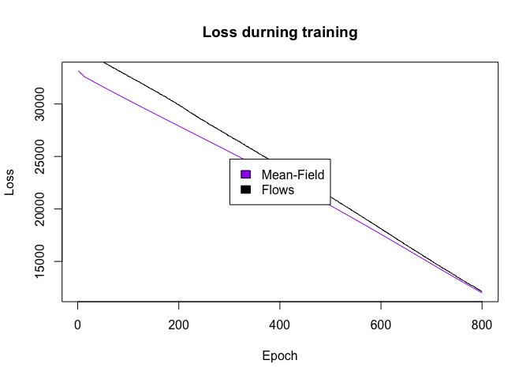
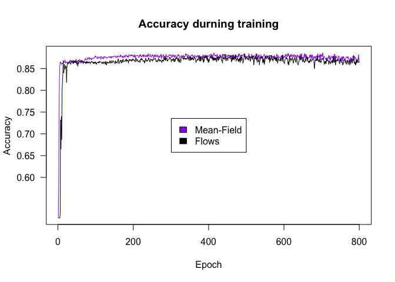
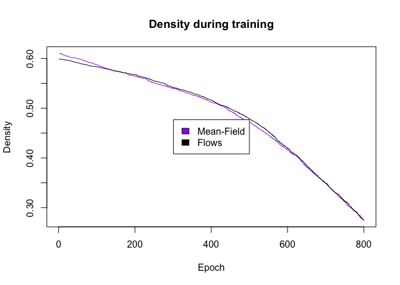

<!-- README.md is generated from README.Rmd. Please edit that file -->

# LBBNN

<!-- badges: start -->
<!-- badges: end -->

The goal of LBBNN is to implement Latent Bayesian Binary Neural Networks
(<https://openreview.net/pdf?id=d6kqUKzG3V>) in R, using the torch for R
package. Currently, standard LBBNNs are implemented. In the future, we
will also implement LBBNNs with input-skip (see
<https://arxiv.org/abs/2503.10496>).

## Installation

You can install the development version of LBBNN from
[GitHub](https://github.com/) with:

``` r
# install.packages("pak")
pak::pak("LarsELund/LBBNN")
```

## Example

This is a basic example which shows you how to implement a simple feed
forward LBBNN on the raisin dataset, both using the mean-field
posterior, and normalizing flows. First we import the neccessary
libraries, then pre-process the data:

``` r
library(LBBNN)
library(ggplot2)
library(torch)

Raisin_Dataset$Class[Raisin_Dataset$Class == 'Kecimen'] = 1
Raisin_Dataset$Class[Raisin_Dataset$Class == 'Besni'] = 0

#split data in training and test sets
set.seed(0)
sample <- sample.int(n = nrow(Raisin_Dataset), size = floor(0.80*nrow(Raisin_Dataset)), replace = FALSE)
train  <- Raisin_Dataset[sample,]
test   <- Raisin_Dataset[-sample,]

#standardize
y_train <- as.numeric(train$Class)
y_test <- as.numeric(test$Class)
x_train <- as.matrix(train[,1:7])
x_test <- as.matrix(test[,1:7])
x_train <- scale(x_train)
x_test <- scale(x_test, center=attr(x_train, "scaled:center"), scale=attr(x_train, "scaled:scale"))

#create tensor dataset and pass it to a dataloader object to enable easy mini-batch based optimization
train_data <- torch::tensor_dataset(torch_tensor(x_train),torch_tensor(y_train)) 
test_data <- torch::tensor_dataset(torch_tensor(x_test),torch_tensor(y_test))
train_loader <- torch::dataloader(train_data, batch_size = 300, shuffle = TRUE)
test_loader <- torch::dataloader(test_data, batch_size = 100)
```

To initialize our LBBNN, we need to define some hyperparameters.
Firstly, the user has to define what type of problem it is. This could
be either binary classification (as in this case), multiclass
classification (more than two classes), or regression (continous
output). In addition the user defines a size vector, where the first
element is the number of variables in the dataset (7 in this case), the
last element is the number of output neurons (1 in our case), and the
elements in between define the number of neurons in the hidden layer(s).
The user must define the prior inclusion probability for each weight
matrix (where each weight will have the same prior probability). This is
an important parameter, as it controls what prior knowledge the user may
have about how dense they believe the network should be. In addition to
this, the user defines the prior standard deviation for the weight and
bias parameters. The user also defines the initialization of the
inclusion parameters.

``` r
problem <- 'binary classification'
sizes <- c(7,500,1) #7 input variables, one hidden layer of 100 neurons, 1 output neuron.
inclusion_priors <-c(0.1,0.1) #one prior probability per weight matrix.
stds <- c(1.0,1.0) #prior standard deviation for each layer.
inclusion_inits <- matrix(rep(c(0,2),2),nrow = 2,ncol = 2) #one low and high for each layer
device <- 'cpu' #can also be mps or gpu.
```

We are now ready to define the models, here we show one with the
mean-field posterior, and one with normalizing flows:

``` r
torch_manual_seed(0)
model_mf <- LBBNN_Net(problem_type = problem,sizes = sizes,prior = inclusion_priors,
                      inclusion_inits = inclusion_inits,input_skip = FALSE,std = stds,
                   flow = FALSE,device = device)
model_flows <- LBBNN_Net(problem_type = problem,sizes = sizes,prior = inclusion_priors,
                   inclusion_inits = inclusion_inits,input_skip = FALSE,std = stds,
                   flow = TRUE,device = device)
```

To train the models, we have a function called train_LBBNN, which takes
as arguments the number of epochs to train for, the model to train, the
learning rate, and the data to train on:

``` r
results_mf <- train_LBBNN(epochs = 100,LBBNN = model_mf, lr = 0.005,train_dl = train_loader,device = device)
results_flow <- train_LBBNN(epochs = 100,LBBNN = model_flows, lr = 0.005,train_dl = train_loader,device = device)
```

Visualize the results:

``` r
plot(results_mf$loss,type = 'l',main = 'Loss durning training',xlab='Epoch',ylab='Loss',col='purple')
lines(results_flow$loss)
legend(x = "center",  
       legend=c("Mean-Field", "Flows"),  
       fill = c("purple","black")) 
```



``` r
plot(results_mf$accs,type = 'l',main = 'Accuracy durning training',xlab='Epoch',ylab='Accuracy',yaxt="n",col='purple')
lines(results_flow$accs)
legend(x = "center",  
       legend=c("Mean-Field", "Flows"),  
       fill = c("purple","black"))
axis(2, at = c(0.60,0.65,0.70,0.75,0.80,0.85), las=2)
```



``` r
plot(results_mf$density,type = 'l',main = 'Density during training',xlab='Epoch',ylab='Density',col='purple')
lines(results_flow$density)
legend(x = "center",  
       legend=c("Mean-Field", "Flows"),  
       fill = c("purple","black"))
```



Finally, to check the results on the validation data, we use the
function Validate_LBBNN, which takes as input a model, the number of
samples for model averaging, and the validation data.

``` r
validate_LBBNN(LBBNN = model_mf,num_samples = 100,test_dl = test_loader,device)
#> $accuracy_full_model
#> [1] 0.8777778
#> 
#> $accuracy_sparse
#> [1] 0.8777778
#> 
#> $density
#> [1] 0.1905
#> 
#> $density_active_path
#> [1] 0.06075
validate_LBBNN(LBBNN = model_flows,num_samples = 100,test_dl = test_loader,device)
#> $accuracy_full_model
#> [1] 0.8833333
#> 
#> $accuracy_sparse
#> [1] 0.8611111
#> 
#> $density
#> [1] 0.187
#> 
#> $density_active_path
#> [1] 0.0525
```
